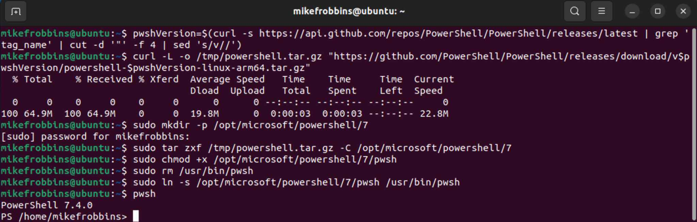

# Install PowerShell on arm64 version of Linux

```bash
pwshVersion=$(curl -s https://api.github.com/repos/PowerShell/PowerShell/releases/latest | grep 'tag_name' | cut -d '"' -f 4 | sed 's/v//')
curl -L -o /tmp/powershell.tar.gz "https://github.com/PowerShell/PowerShell/releases/download/v$pwshVersion/powershell-$pwshVersion-linux-arm64.tar.gz"
sudo mkdir -p /opt/microsoft/powershell/7
sudo tar zxf /tmp/powershell.tar.gz -C /opt/microsoft/powershell/7
sudo chmod +x /opt/microsoft/powershell/7/pwsh
sudo rm /usr/bin/pwsh
sudo ln -s /opt/microsoft/powershell/7/pwsh /usr/bin/pwsh
```


